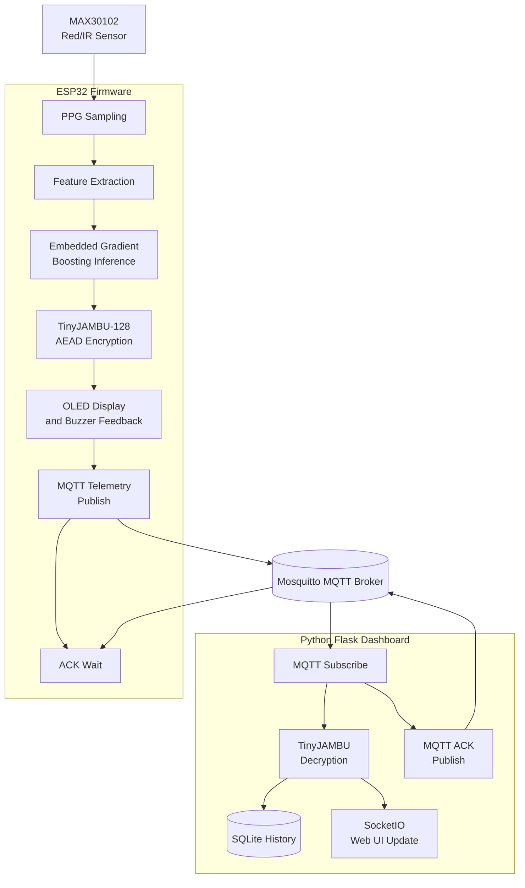
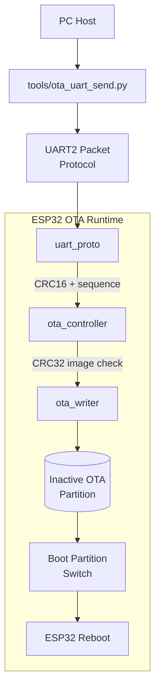

# Non-Invasive Glucose Monitoring

## Overview

This repository contains an ESP-IDF based prototype for non-invasive glucose monitoring. The system uses an ESP32, a MAX30102 optical sensor, an SSD1306 OLED display, an embedded machine-learning model, TinyJAMBU-128 AEAD encryption, MQTT telemetry, a Python web dashboard, and a custom dual-bank UART OTA update mechanism.

The firmware reads Red and IR PPG samples from the MAX30102, detects finger placement, collects a fixed sampling window, extracts signal features, runs an embedded Gradient Boosting model, displays the predicted glucose value, encrypts the result, and publishes telemetry to an MQTT broker. A Python Flask dashboard subscribes to the MQTT topic, decrypts the payload, stores measurements in SQLite, updates the web UI through SocketIO, and sends an ACK message back to the ESP32.

The project also includes a custom UART OTA protocol. A host PC sends firmware images as START, DATA, END, and ABORT packets. The ESP32 validates each packet with CRC16, validates the full image with CRC32, writes the image to the inactive OTA partition, switches the next boot partition, and reboots.

This is a research and demonstration prototype. It is not a medical device, and its glucose estimates must not be used for diagnosis or treatment decisions.

## Key Features

| Area | Description |
| --- | --- |
| PPG acquisition | Reads Red and IR samples from the MAX30102 over I2C. |
| Finger detection | Uses a fixed IR threshold in firmware. |
| Feature extraction | Computes optical ratio, signal variability, and waveform slope. |
| Embedded inference | Runs a Gradient Boosting model directly on the ESP32. |
| Local feedback | Displays measurement state and results on an SSD1306 OLED. |
| Alerts | Uses a PWM buzzer for low and high glucose thresholds. |
| Payload security | Encrypts glucose values with TinyJAMBU-128 AEAD before MQTT upload. |
| MQTT telemetry | Publishes encrypted JSON telemetry and waits for dashboard ACK. |
| Web dashboard | Flask, SocketIO, SQLite, MQTT subscriber, and ACK publisher. |
| UART OTA | Updates firmware through UART2 with packet CRC16 and image CRC32. |
| Rollback support | Tracks OTA validation using NVS and ESP-IDF OTA state. |

## System Architecture



The OTA path is independent from the glucose measurement pipeline:



## Repository Structure

| Path | Purpose |
| --- | --- |
| `main/main.c` | Firmware entry point, NVS setup, OTA rollback check, OTA task creation, and main loop. |
| `main/app/glucose_monitor.c` | Glucose measurement state machine, WiFi, MQTT, OLED, buzzer, TinyJAMBU, and telemetry upload. |
| `main/app/ota_test_app.c` | Minimal firmware used to validate UART OTA independently from the glucose pipeline. |
| `main/drivers/max30102.c` | MAX30102 driver using ESP-IDF I2C. |
| `main/drivers/ssd1306.c` | SSD1306 OLED driver. |
| `main/model/gradient_boosting_model.h` | Exported Gradient Boosting model used by firmware inference. |
| `main/crypto/` | TinyJAMBU headers and static library used by the ESP32 firmware. |
| `main/ota/crc_until.c` | CRC16/CCITT-FALSE and CRC32 utilities. |
| `main/ota/uart_proto.c` | UART framing, packet parsing, CRC16 validation, and ACK/NACK responses. |
| `main/ota/ota_controller.c` | START/DATA/END/ABORT state machine, sequence validation, and image CRC32 verification. |
| `main/ota/ota_writer.c` | ESP-IDF OTA API wrapper for writing, finishing, aborting, boot partition selection, and rollback. |
| `main/ota/nvs_store.c` | NVS storage for OTA pending state and boot attempt counter. |
| `tools/ota_uart_send.py` | Host-side sender for the custom UART OTA protocol. |
| `tools/*.sh` | Build, initial flash, OTA transfer, and OTA test helper scripts. |
| `app/app.py` | Flask dashboard, MQTT subscriber, TinyJAMBU decryptor, SQLite storage, and ACK publisher. |
| `app/Gateway.py` | Bridge from the local MQTT broker to ThingsBoard. |
| `app/tinyjambu.py` | Python binding used to decrypt TinyJAMBU payloads. |
| `software/train_model.py` | Model training pipeline for glucose prediction data. |
| `software/convert_to_cpp/` | Model export tools for generating C/C++ firmware headers. |
| `partitions.csv` | ESP32 partition table with NVS, OTA data, PHY init, `ota_0`, and `ota_1`. |
| `doc/` | Detailed technical documentation by subsystem. |
| `video_demo/` | Demo videos for glucose measurement and UART OTA. |

## Hardware

| Component | Interface | ESP32 pins |
| --- | --- | --- |
| MAX30102 | I2C0 | SDA GPIO32, SCL GPIO33 |
| SSD1306 OLED | I2C0 | SDA GPIO32, SCL GPIO33 |
| Buzzer | LEDC PWM | GPIO25 |
| UART OTA | UART2 | RX GPIO26, TX GPIO27 |
| Default flash and logs | UART0 | Board-dependent onboard USB-UART |

External USB-UART wiring for OTA:

```text
USB-UART TX -> ESP32 GPIO26
USB-UART RX -> ESP32 GPIO27
USB-UART GND -> ESP32 GND
```

Use a 3.3 V USB-UART adapter. ESP32 GPIO pins are not 5 V tolerant.

## Firmware Architecture

The firmware supports two build modes:

| Mode | Description |
| --- | --- |
| Full application | Runs the glucose pipeline, WiFi, MQTT, OLED, sensor drivers, and OTA task. |
| OTA test application | Minimal firmware that prints version, running partition, and heartbeat logs for OTA validation. |

Main boot flow:

```text
app_main
  -> app_nvs_init
  -> ota_boot_health_check
  -> glucose_monitor_init or ota_test_app_init
  -> ota_confirm_running_app_if_pending
  -> xTaskCreate(ota_task)
  -> main loop
```

Runtime tasks:

| Task | Responsibility |
| --- | --- |
| Main loop | Calls `glucose_monitor_process()` or `ota_test_app_process()` every 10 ms. |
| OTA task | Waits for UART2 packets, validates them, writes OTA images, and returns ACK/NACK. |

## Glucose Measurement Pipeline

The measurement state machine is implemented in `main/app/glucose_monitor.c`.

```text
STATE_IDLE
  -> STATE_STABILIZING
  -> STATE_SAMPLING
  -> STATE_PREDICT
  -> STATE_UPLOADING
  -> STATE_WAIT_RELEASE
  -> STATE_IDLE
```

Main parameters:

| Parameter | Value | Meaning |
| --- | ---: | --- |
| `FINGER_THRESHOLD` | 30000 | IR threshold used for finger detection. |
| `SAMPLE_WINDOW` | 2000 ms | Sampling duration for one measurement. |
| `SAMPLE_RATE` | 100 Hz | Logical sampling rate. |
| `BUFFER_SIZE` | 200 samples | Number of Red/IR samples used for feature extraction. |
| `STABILIZE_WINDOW_MS` | 5000 ms | Signal stabilization time before sampling. |

Model input features:

| Feature | Calculation |
| --- | --- |
| `features[0]` | Mean IR divided by Mean Red. |
| `features[1]` | RMS of consecutive IR differences. |
| `features[2]` | Slope between valid IR minimum and maximum points. |
| `full_features[3]` | `60.0 / (features[1] + epsilon)`. |
| `full_features[4]` | `features[1] / (features[0] + epsilon)`. |

The embedded model is called as:

```c
predict_gradient_boosting(full_features)
```

After prediction, the firmware formats the plaintext as:

```text
GLUCOSE:<value>
```

The plaintext is encrypted with TinyJAMBU-128 AEAD, encoded as hexadecimal text, and published through MQTT.

## MQTT and Dashboard

The current default MQTT broker configuration is:

```text
Broker: 192.168.1.144
Port: 1883
```

If the Mosquitto host IP changes, update these files before rebuilding or restarting:

| File | Field |
| --- | --- |
| `main/app/glucose_monitor.c` | `MQTT_URI` |
| `app/app.py` | `MQTT_BROKER` |
| `app/Gateway.py` | `local_broker` |

Telemetry topic:

```text
medical/glucose_monitor/telemetry
```

Telemetry payload:

```json
{
  "timestamp": 123456,
  "encrypted_hex": "...",
  "glucose": 105.50,
  "length": 28
}
```

ACK topics:

```text
medical/glucose_monitor/ack
node/sensor_phong_khach/ack
```

The dashboard workflow is:

1. Connect to the Mosquitto broker.
2. Subscribe to telemetry topics.
3. Read the `encrypted_hex` field.
4. Decrypt the TinyJAMBU payload.
5. Classify the glucose value.
6. Store the measurement in SQLite.
7. Emit a realtime SocketIO update to the web UI.
8. Publish an ACK back to the ESP32.

Classification thresholds:

| Condition | Classification |
| --- | --- |
| `glucose > 180.0` | Hyperglycemia |
| `glucose < 70.0` | Hypoglycemia |
| Otherwise | Normal |

## UART OTA

The OTA protocol transfers firmware over UART2 at 115200 baud. The host splits a `.bin` image into DATA packets with a maximum payload size of 256 bytes.

Integrity mechanisms:

| Mechanism | Purpose |
| --- | --- |
| CRC16/CCITT-FALSE | Detects corruption in each UART packet. |
| Sequence number | Detects missing or out-of-order packets. |
| ACK/NACK | Allows the host to retry failed packets. |
| CRC32 image check | Verifies the complete firmware image before boot selection. |

Partition table:

| Partition | Type | Offset | Size |
| --- | --- | ---: | ---: |
| `nvs` | data | `0x9000` | `0x4000` |
| `otadata` | data | `0xd000` | `0x2000` |
| `phy_init` | data | `0xf000` | `0x1000` |
| `ota_0` | app | `0x10000` | `0x1F0000` |
| `ota_1` | app | `0x200000` | `0x1F0000` |

Successful OTA flow:

```text
START_OTA
  -> begin writing to inactive OTA partition
DATA packets
  -> validate CRC16
  -> validate sequence number
  -> write to flash
  -> update streaming CRC32
END_OTA
  -> compare total size
  -> compare CRC32
  -> finish OTA
  -> set boot partition
  -> reboot
```

Rollback behavior:

1. After a successful OTA transfer, the new image boots in pending validation state.
2. The firmware increments a boot counter when it detects a pending image.
3. If application initialization succeeds, the firmware marks the running image as valid.
4. If the boot attempt limit is exceeded, the firmware marks the image invalid and rolls back.

## Requirements

Firmware:

| Requirement | Notes |
| --- | --- |
| ESP-IDF | The project has been built with ESP-IDF 6.0.x. |
| ESP32 target | `CONFIG_IDF_TARGET_ESP32=y`. |
| espressif/mqtt | Declared in `main/idf_component.yml`. |
| USB-UART adapter | Required for UART2 OTA transfer. |

Python dashboard and host tools:

| Requirement | Notes |
| --- | --- |
| Python 3 | Used by the Flask dashboard and OTA sender. |
| Mosquitto | Local MQTT broker. |
| pyserial | Used by `tools/ota_uart_send.py`. |
| Flask, Flask-SocketIO, paho-mqtt | Used by the dashboard. |
| SQLite | Stores measurement history in `app/glucose_history.db`. |

## Build Firmware

Source ESP-IDF if it is not already available in the shell:

```bash
source /home/minhquocnguyenhoang/Tools/esp/esp-idf/export.sh
```

Build the full firmware:

```bash
idf.py build
```

The generated OTA binary is:

```text
build/glucose_monitor_espidf.bin
```

Build the minimal OTA test firmware:

```bash
idf.py -B build_ota_test \
  -DAPP_OTA_TEST_MODE=ON \
  -DAPP_OTA_TEST_VERSION=ota-demo-v2 \
  build
```

Or use the helper script:

```bash
./tools/build_ota_test.sh ota-demo-v2
```

## Flash and Run

Initial flash through the board UART0:

```bash
./tools/flash_initial.sh /dev/ttyUSB0
```

Send the already built full firmware through UART2 OTA:

```bash
./tools/ota_full.sh /dev/ttyUSB1
```

Send a specific binary:

```bash
./tools/ota_full.sh /dev/ttyUSB1 build/glucose_monitor_espidf.bin
```

Build and send the OTA test firmware:

```bash
./tools/ota_test.sh /dev/ttyUSB1 ota-demo-v2
```

Open the ESP-IDF monitor:

```bash
idf.py -p /dev/ttyUSB0 monitor
```

Wait for this log before starting an OTA transfer:

```text
OTA task started on UART2 RX=26 TX=27
```

## Run MQTT Broker and Dashboard

Check Mosquitto:

```bash
systemctl status mosquitto
```

Check port 1883:

```bash
ss -ltnp | grep 1883
```

Run the dashboard:

```bash
./run_app.sh
```

The dashboard runs at:

```text
http://localhost:5000
```

Test MQTT from the command line:

```bash
mosquitto_sub -h 192.168.1.144 -p 1883 -t medical/glucose_monitor/telemetry
```

Publish a sample message:

```bash
mosquitto_pub \
  -h 192.168.1.144 \
  -p 1883 \
  -t medical/glucose_monitor/telemetry \
  -m '{"timestamp":1,"encrypted_hex":"00","glucose":105.5,"length":1}'
```

## Model Training and Export

The training pipeline is implemented in `software/train_model.py`.

| Step | Description |
| --- | --- |
| Data loading | Reads a single CSV file or a directory of CSV files. |
| Preprocessing | Handles imputation, outlier removal, and feature standardization. |
| Models | Supports Linear Regression, Random Forest, and Gradient Boosting. |
| Evaluation | Reports MAE, RMSE, R2, clinical accuracy, and Clarke Error Grid analysis. |
| Export | Produces joblib files, evaluation plots, and C/C++ headers for firmware use. |

Example:

```bash
cd software
python3 train_model.py --model gradient_boosting --data sample_data/training_sample.csv
```

Export a model to a firmware header:

```bash
cd software/convert_to_cpp
python3 export_model_to_cpp.py --help
```

The firmware currently includes:

```text
main/model/gradient_boosting_model.h
```

## Demo Videos

The repository includes two MP4 demo videos under `video_demo/`.

| File | Description | 
| --- | --- | 
| [`video_demo/demo_glucose.mp4`](video_demo/demo_glucose.mp4) | End-to-end glucose measurement demonstration. | 
| [`video_demo/demo_ota.mp4`](video_demo/demo_ota.mp4) | UART OTA firmware update demonstration. | 

## Technical Documentation

Detailed documentation is available in `doc/`.

| File | Content |
| --- | --- |
| `doc/01_project_overview.md` | System overview, source tree, and module responsibilities. |
| `doc/02_firmware_architecture.md` | Firmware architecture, boot flow, runtime tasks, and state machines. |
| `doc/03_uart_ota_protocol.md` | UART OTA packet format, command set, ACK/NACK, and sequence numbers. |
| `doc/04_crc_integrity.md` | CRC16 for packets and CRC32 for firmware image verification. |
| `doc/05_ota_flash_and_rollback.md` | OTA flash writing, dual-bank partitioning, boot partition switching, and rollback. |
| `doc/06_host_tools_and_demo.md` | Build, flash, demo scripts, expected logs, and OTA troubleshooting. |
| `doc/07_glucose_pipeline.md` | MAX30102 acquisition, feature extraction, model inference, TinyJAMBU, and MQTT telemetry. |
| `doc/08_module_api_reference.md` | Internal firmware API reference. |
| `doc/09_requirement_traceability.md` | Mapping between project requirements and implementation. |
| `doc/10_ota_test_firmware.md` | Minimal OTA test firmware and repeatable demo workflow. |

## Troubleshooting

### ESP32 does not connect to WiFi

Check `WIFI_SSID` and `WIFI_PASS` in:

```text
main/app/glucose_monitor.c
```

The ESP32 must connect to a 2.4 GHz WiFi network. If the router or hotspot changes, rebuild and flash the firmware.

### ESP32 connects to WiFi but MQTT times out

Check the broker IP in:

```text
main/app/glucose_monitor.c
```

Check the Mosquitto host:

```bash
ip -4 addr
ss -ltnp | grep 1883
```

If the computer IP changed, update `MQTT_URI`, rebuild, and flash the firmware.

### Dashboard does not receive data

Check `MQTT_BROKER` in:

```text
app/app.py
```

Verify that the dashboard subscribes to:

```text
medical/glucose_monitor/telemetry
```

Use `mosquitto_pub` and `mosquitto_sub` to verify broker connectivity.

### OTA times out at the first packet

Common causes:

| Cause | Check |
| --- | --- |
| Firmware does not include the OTA task | Wait for `OTA task started on UART2 RX=26 TX=27`. |
| Wrong serial port | Unplug and replug the USB-UART adapter, then check `/dev/ttyUSB*`. |
| TX/RX wiring is swapped incorrectly | USB-UART TX must connect to GPIO26, and USB-UART RX must connect to GPIO27. |
| Missing common ground | Connect USB-UART GND to ESP32 GND. |
| Wrong logic level | Use a 3.3 V USB-UART adapter. |

### OTA CRC or sequence errors

Check UART wiring, power stability, baud rate, and chunk size. Try a lower baud rate or a smaller `--chunk-size` with `tools/ota_uart_send.py`.

### Firmware image is too large

Each OTA partition is currently `0x1F0000` bytes. If the firmware exceeds this size, reduce the firmware size or adjust `partitions.csv`.

## Current Limitations

| Limitation | Notes |
| --- | --- |
| Not a medical device | The system demonstrates architecture and data flow only. |
| Simple finger detection | Uses a fixed IR threshold instead of adaptive thresholding. |
| Basic feature extraction | Does not yet include advanced PPG filtering or per-user calibration. |
| Model depends on sample data | Accuracy depends on the size and quality of the training dataset. |
| Fixed TinyJAMBU nonce | Acceptable for demonstration only; a real system needs a unique nonce per message. |
| Hardcoded WiFi and MQTT settings | Should be moved to NVS, menuconfig, or provisioning. |
| Legacy I2C driver | ESP-IDF 6.0 warns that `driver/i2c.h` is EOL and should be migrated. |

## Future Work

1. Move WiFi and MQTT configuration to NVS or menuconfig.
2. Add provisioning so network settings can be changed without rebuilding firmware.
3. Generate TinyJAMBU nonces from an NVS counter, timestamp, device ID, or a combination of them.
4. Store raw PPG samples for model evaluation and retraining.
5. Add PPG filtering, adaptive thresholding, and per-user calibration.
6. Migrate I2C code to `driver/i2c_master.h`.
7. Add automated tests for CRC utilities, packet parsing, OTA controller behavior, and MQTT payload handling.
8. Add a `requirements.txt` file for Python dependencies.
